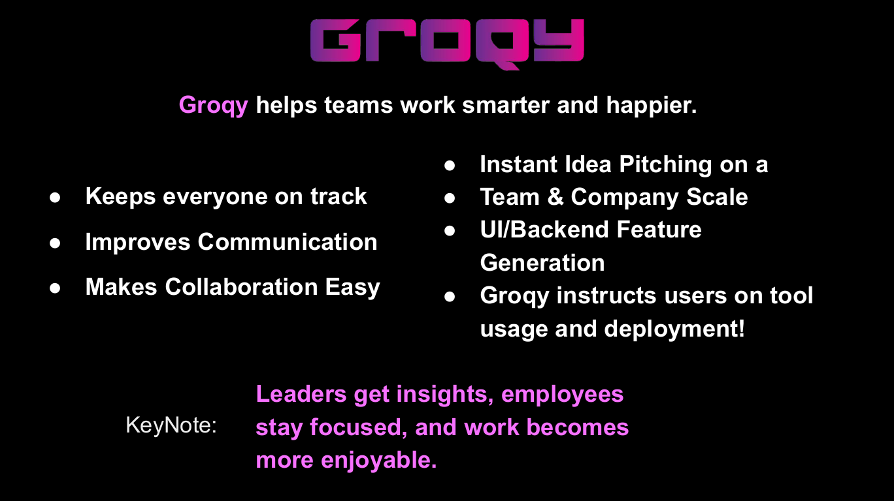

<p align="center">
  
</p>
<p align="center">
  <a href="https://groqy.com"></a>
  <a href="https://discord.gg/ZU2SndazHJ"></a>
</p>

# Groqy Quantum Nexus
Welcome to the Groqy Quantum Nexus! This project aims to revolutionize the deployment of agentic experts through cutting-edge technology.

[Lablab Hackathon Slides](https://docs.google.com/presentation/d/1SbhkJdPqVMvNKBs31xUrVZUNqBMJHTyogBoD8Nr-xKI/edit?usp=sharing)

<p align="center">
  
</p>

## Overview
The Groqy Quantum Nexus brings agentic experts to the next level of deployment via the Gravity RAG Infinite Streaming Context and the GOD Matrix API Hub for infinite tooling deployment possibilities.

## Features
Gravity RAG Infinite Streaming Context: Seamlessly integrates and streams context for enhanced deployment.

GOD Matrix API Hub: Provides a robust API hub for limitless tooling deployment.

Agent Swarm UI generation and deployment for ollama, openai api, anthropic api, groqapi, and more.

## Getting Started

First, run the development server:

```bash
npm run dev
# or
yarn dev
# or
pnpm dev
# or
bun dev
```

Open [http://localhost:3000](http://localhost:3000) with your browser to see the result.

You can start editing the page by modifying `app/page.js`. The page auto-updates as you edit the file.

This project uses [`next/font`](https://nextjs.org/docs/basic-features/font-optimization) to automatically optimize and load Inter, a custom Google Font.

## Learn More

To learn more about Next.js, take a look at the following resources:

- [Next.js Documentation](https://nextjs.org/docs) - learn about Next.js features and API.
- [Learn Next.js](https://nextjs.org/learn) - an interactive Next.js tutorial.

You can check out [the Next.js GitHub repository](https://github.com/vercel/next.js/) - your feedback and contributions are welcome!

## Deploy on Vercel

The easiest way to deploy your Next.js app is to use the [Vercel Platform](https://vercel.com/new?utm_medium=default-template&filter=next.js&utm_source=create-next-app&utm_campaign=create-next-app-readme) from the creators of Next.js.

Check out our [Next.js deployment documentation](https://nextjs.org/docs/deployment) for more details.
=======
# groqy
strawberry hackathon
>>>>>>> 6f9284d9b8b0ef03f4bc1b18b76bd542b76844f8
