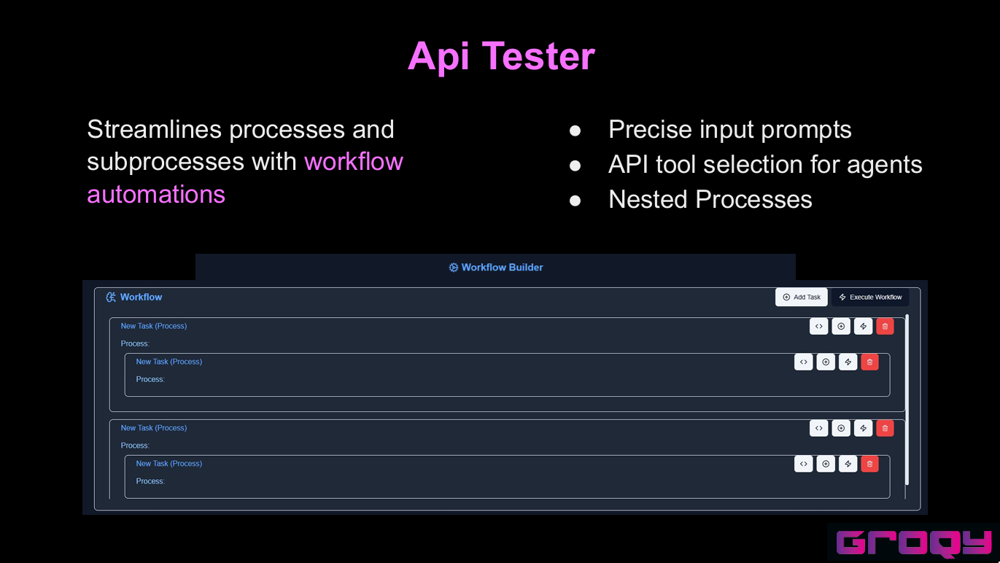
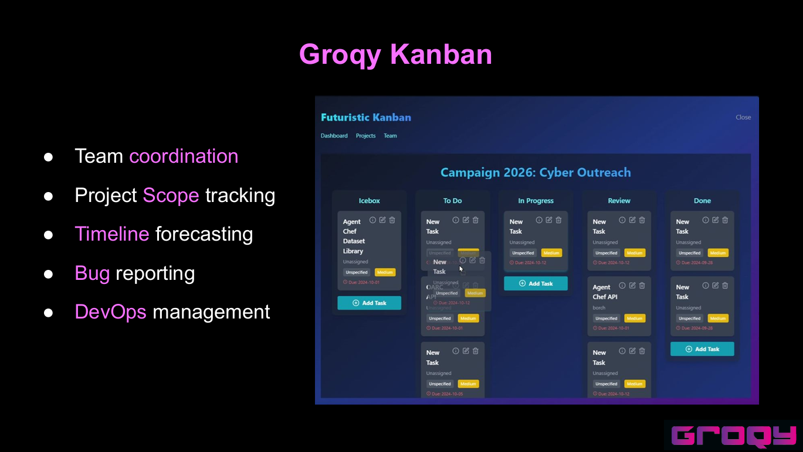
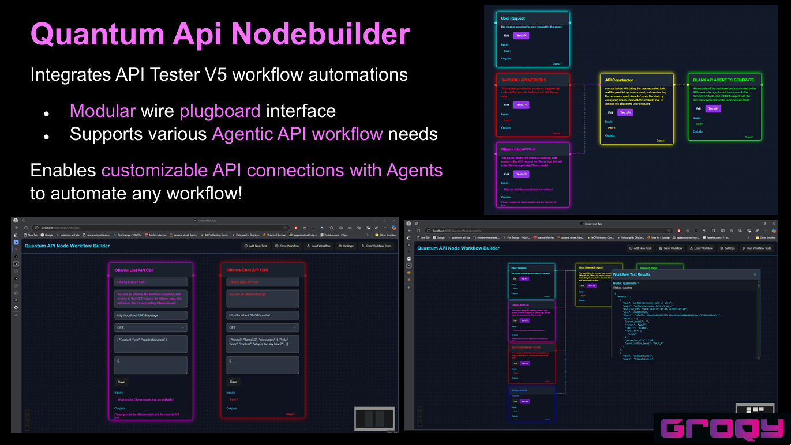

<p align="center">
  
</p>
<p align="center">
  <a href="https://groqy.com"></a>
  <a href="https://discord.gg/ZU2SndazHJ"></a>
</p>

# Groqy Quantum Nexus
Welcome to the Groqy Quantum Nexus! This project aims to revolutionize the deployment of agentic experts through cutting-edge technology.

[Lablab Hackathon Slides](https://docs.google.com/presentation/d/1SbhkJdPqVMvNKBs31xUrVZUNqBMJHTyogBoD8Nr-xKI/edit?usp=sharing)

<p align="center">
  
</p>

## Overview
The Groqy Quantum Nexus brings agentic experts to the next level of deployment via the Gravity RAG Infinite Streaming Context and the GOD Matrix API Hub for infinite tooling deployment possibilities.

## API Tester V5

<p align="center">
  
</p>

## Kanban Board
<p align="center">
  
</p>

## Quantum Api Nodebuilder
<p align="center">
  
</p>


## Getting Started
First, run the development server:

```bash
npm run dev
# or
yarn dev
# or
pnpm dev
# or
bun dev
```

Open [http://localhost:3000](http://localhost:3000) with your browser to see the result.
